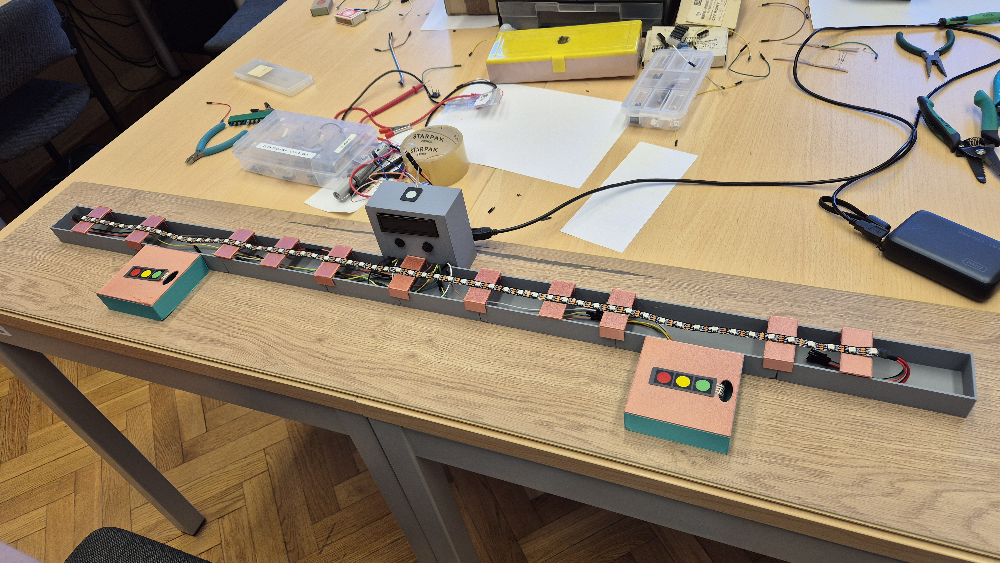

# LED Tug Shooter

Gra dla 2 graczy (lub 1 w trybie Solo) zbudowana na Arduino Uno z taśmą LED NeoPixel, wyświetlaczem LCD i buzzerem. Projekt zaliczeniowy z przedmiotu Pracownia pomiarów i sterowania.



---

## Jak się gra?

Dwóch graczy stoi po przeciwnych stronach taśmy LED. Każdy ma kontroler z trzema kolorowymi przyciskami (czerwony, zielony, niebieski).

Po taśmie lecą kolorowe "doty" — zadaniem gracza jest strzelić kulką w tym samym kolorze co dot. Trafienie przesuwa separator w stronę przeciwnika. Kto zepchnąć separator za linię przeciwnika — wygrywa rundę.

### Tryby gry
- **2 graczy** — klasyczna rozgrywka, obaj gracze strzelają jednocześnie
- **Solo** — doty lecą z jednej strony, gracz broni się sam

---

## Hardware

| Komponent | Opis |
|-----------|------|
| Arduino Uno | Główny mikrokontroler |
| Taśma LED NeoPixel | 60 diód RGB (FastLED) |
| Wyświetlacz LCD 16x2 I2C | Wynik i komunikaty (adres 0x27) |
| Buzzer | Efekty dźwiękowe |
| 6 przycisków RGB | 3 na gracza (czerwony, zielony, niebieski) |
| Przycisk START | Włączanie, pauza, powrót do menu |

### Schemat pinów

| Pin | Funkcja |
|-----|---------|
| 2, 3, 4 | Przyciski gracza 1 (R, G, B) |
| 6 | Taśma LED (DATA) |
| 7, 8, 9 | Przyciski gracza 2 (R, G, B) |
| 10 | Buzzer |
| 11 | Przycisk START |
| A4, A5 | LCD I2C (SDA, SCL) |

---

## Software

Napisany w C++ (Arduino). Architektura oparta na maszynie stanów:

```
OFF → Menu główne → Wybór trybu → Gra ⇄ Pauza → Game Over
                                              ↓
                                         Menu główne
```

### Główne elementy
- **Maszyna stanów** — 6 stanów (OFF, menu, wybór trybu, gra, pauza, game over)
- **Timery przez `millis()`** — brak blokującego `delay()` w głównej pętli
- **Hold detection** — rozróżnienie krótkiego i długiego wciśnięcia przycisku START
- **Separator** — ruchomy punkt podziału taśmy reagujący na trafienia
- **Buzzer** — osobne melodie dla strzału, trafienia, złego trafienia i game over

---

## Biblioteki

```cpp
#include <FastLED.h>
#include <Wire.h>
#include <LiquidCrystal_I2C.h>
```

---

## 🖥️ Symulacja (Wokwi)

Projekt zawiera pliki do uruchomienia symulacji w przeglądarce bez żadnego hardware:

1. Wejdź na [wokwi.com](https://wokwi.com) i zaloguj się.
2. Kliknij **New Project** → **Arduino Uno**.
3. Wgraj pliki `sketch.ino`, `diagram.json` i `libraries.txt` do projektu.
4. Kliknij **Start Simulation**.

---

## Jak uruchomić

1. Podłącz komponenty zgodnie ze schematem pinów.
2. Zainstaluj biblioteki: `FastLED`, `LiquidCrystal I2C`.
3. Wgraj szkic na Arduino Uno przez Arduino IDE.
4. Wciśnij czarny przycisk START żeby włączyć konsolę.
